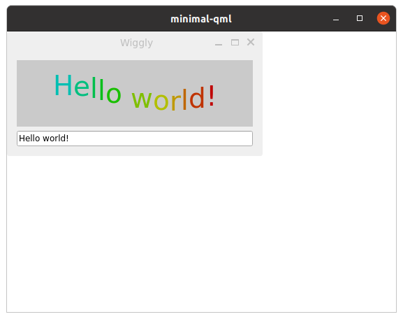

# Minimal QML Project

This is a minimal example of a QML-based application using Qt. The project demonstrates how to create a Wayland compositor and display real-time updates, such as the current time, using both QML and C++.

## Features
- **Wayland Compositor**: Implements a basic Wayland compositor using `QtWayland.Compositor`.
- **Real-Time Clock**: Displays the current time, updated every second.
- **C++ Integration**: Uses a C++ backend (`TimeUpdater`) to manage the timer and send updates to QML.

## Project Structure
```
minimal-qml/
├── CMakeLists.txt       # CMake build configuration
├── main.cpp             # Application entry point
├── main.qml             # QML UI definition
├── TimeUpdater.h        # Header for the C++ backend class
├── TimeUpdater.cpp      # Implementation of the C++ backend class
├── minimal-qml.pro      # Qt project file (for qmake builds)
├── minimal-qml.qrc      # Resource file for QML assets
├── .gitignore           # Git ignore file
└── README.md            # Project documentation
```

## Requirements
- **Qt 6** or later
- C++17 or later
- CMake (for building with CMake)

## Build and Run

### Using CMake
1. Create a build directory:
   ```bash
   mkdir build && cd build
   ```
2. Configure the project:
   ```bash
   cmake ..
   ```
3. Build the project:
   ```bash
   cmake --build .
   ```
4. Run the application:
   ```bash
   ./minimal-qml
   ```

### Using qmake
1. Run qmake to generate the Makefile:
   ```bash
   qmake minimal-qml.pro
   ```
2. Build the project:
   ```bash
   make
   ```
3. Run the application:
   ```bash
   ./minimal-qml
   ```

## How It Works
- **Wayland Compositor**: The `WaylandCompositor` in `main.qml` defines the basic compositor functionality.
- **Real-Time Clock**: The `TimeUpdater` class in C++ uses a `QTimer` to update the current time every second. This value is exposed to QML via `Q_PROPERTY`.
- **QML Integration**: The `TimeUpdater` object is registered in QML using `QQmlContext`, allowing the `currentTime` property to be bound to a `Text` element in `main.qml`.

## License
This project is licensed under the terms of the **Qt Commercial License** or **BSD-3-Clause License**. See the source files for details.

## Screenshot


## Contributing
Contributions are welcome! Feel free to open issues or submit pull requests.

## Author
This project was created as an example to demonstrate QML and C++ integration with Qt.
